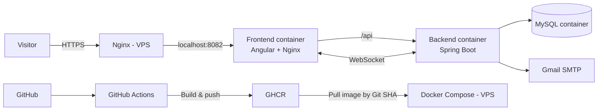
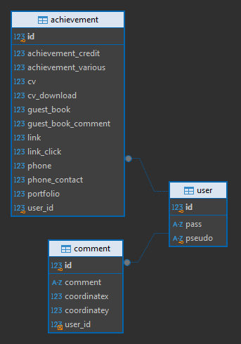

# Zelda CV — Interactive Full-Stack Portfolio

> An interactive portfolio built as a 2D game: explore a map, discover my experience and projects, interact with the environment, and see other visitors in real time.

**Live:** https://quentinverscheure.fr

## Why this project?

Zelda CV started as a way to build a portfolio that demonstrates technical skills through the product itself rather than only listing them on a conventional résumé.

The project combines a game-oriented Angular frontend with a Spring Boot backend and a production deployment pipeline. It covers frontend architecture, REST APIs, real-time communication, authentication, persistence, containerization, reverse proxying, HTTPS, and CI/CD.

## Main features

- **Interactive 2D portfolio** built with Angular and Phaser.
- **CV and project exploration** directly inside the game world.
- **Real-time multiplayer presence** through WebSockets: connected visitors can see each other moving on the map.
- **Interactive guestbook** with persistent comments stored in MySQL.
- **Contact form** sending email through the Spring Boot backend.
- **JWT authentication** for protected backend endpoints.
- **REST API documented with OpenAPI / Swagger.**
- **Data-driven content**: CV, portfolio, links, NPC texts and other information are separated from the application logic.
- **Responsive production deployment** behind Nginx and HTTPS.

## Tech stack

| Layer | Technologies |
| --- | --- |
| Frontend | Angular 21, TypeScript, Phaser, RxJS |
| Backend | Java 17, Spring Boot 3.3, Spring Web, Spring Data JPA |
| Realtime | WebSocket |
| Security | Spring Security, JWT |
| Database | MySQL 8 |
| API documentation | Springdoc OpenAPI / Swagger UI |
| Email | Spring Mail / Gmail SMTP |
| Containerization | Docker, Docker Compose |
| CI/CD | GitHub Actions, GitHub Container Registry (GHCR) |
| Production | Ubuntu VPS, Nginx reverse proxy, HTTPS |

## Architecture



Only the host Nginx is exposed publicly. The application containers communicate through the Docker network; MySQL and the Spring Boot port are not exposed directly to the Internet.

## CI/CD and production deployment

A push to `master` triggers the deployment workflow:

1. GitHub Actions builds the backend and frontend Docker images.
2. Images are published to GHCR with both `latest` and the Git commit SHA.
3. The deployment job connects to the VPS over SSH.
4. Docker Compose pulls the images identified by the commit SHA.
5. The frontend and backend containers are recreated from those immutable images.
6. MySQL data remains persisted in a Docker volume.

Using the Git SHA makes the deployed application version traceable and allows a previous image version to be redeployed manually if a rollback is required.

Production secrets are **not baked into Docker images or committed to Git**. They are injected at runtime through environment variables on the VPS.

## Repository structure

```text
zelda-cv/
├── front/                  # Angular + Phaser application
├── back/                   # Spring Boot REST/WebSocket backend
├── .github/workflows/      # CI/CD and rollback workflows
├── compose.yaml            # Common Docker Compose configuration
└── compose.prod.yaml       # Production-specific Compose overrides
```

## Local development

### Requirements

- Docker / Docker Compose, or:
  - Node.js for the frontend
  - Java 17 for the backend
- MySQL 8 when running without Docker

### Frontend

```bash
cd front
npm ci
npm start
```

The Angular development server is available on `http://localhost:4200`.

Production build:

```bash
npm run build
```

### Backend

A Maven Wrapper is included, so Maven does not need to be installed globally.

Linux/macOS:

```bash
cd back
./mvnw spring-boot:run
```

Windows:

```powershell
cd back
.\mvnw.cmd spring-boot:run
```

Swagger UI is available locally at:

```text
http://localhost:8080/swagger-ui/index.html
```

### Docker

The application can also be built and started through Docker Compose:

```bash
docker compose up --build
```

The exact environment variables required by the project are documented in the repository's environment example file. Never commit real credentials.

## Content customization

Most portfolio content is intentionally separated from the application code.

### CV and portfolio data

In `front/src/assets/texts`:

- `cv_data.yaml` — CV content
- `portfolio_data.yaml` — projects
- `link_data.yaml` — external links
- `various_data.yaml` — additional personal information

The downloadable CV is stored in:

```text
front/src/assets/docs/CV.pdf
```

General frontend configuration is located in:

```text
front/src/assets/config.json
```

### NPC dialogue

NPC text files are stored under:

```text
front/src/assets/game
```

This allows dialogue/content changes without modifying the game logic.

## Creating and editing maps

Scenes can be edited with the software **Tiled**:

1. Create or import the map image.
2. Create tile/image layers for the visual environment.
3. Add object layers for hitboxes and interactive zones.
4. Export the map as JSON.
5. Load the generated data from the Angular/Phaser frontend.

The project primarily uses a 16×16 pixel grid.

## API and authentication

The backend exposes REST endpoints and WebSocket communication.

Swagger UI can be used to inspect and test the REST API. Protected endpoints use JWT authentication through Spring Security.

Typical authentication flow:

```text
Create/login user
      ↓
Spring Security
      ↓
JWT returned
      ↓
Authorization: Bearer <token>
      ↓
Protected endpoint
```

## Database

Persistence is handled with Spring Data JPA and MySQL.



In production, MySQL data is stored in a persistent Docker volume so application container deployments do not recreate the database.

## Security choices

- HTTPS termination through Nginx.
- Backend and database ports are not publicly exposed.
- SSH password authentication is disabled on the VPS; key-based authentication is used.
- Root cannot authenticate directly over SSH with a password.
- Production credentials are injected at runtime and excluded from Git.
- GitHub Actions uses a dedicated SSH key for deployment.
- GHCR images are deployed by immutable Git SHA.
- Ubuntu unattended security upgrades are enabled.
- UFW only exposes the required public services (SSH, HTTP and HTTPS).

Two moderate vulnerabilities currently remain in a transitive frontend dependency (`i18next-http-backend` through `phaser3-rex-plugins`). They are intentionally not force-upgraded because `npm audit fix --force` would require a potentially breaking dependency change. They are tracked for reassessment when a compatible upstream version is available.

## Engineering notes

Removed functionality that may be useful again is occasionally marked with the Git tag `delete-functionality` to make historical implementations easier to locate.

previous focntionality: joystick on smartphone

## Legal notice

This is a non-commercial fan portfolio inspired by *The Legend of Zelda: Link's Awakening*. It is not affiliated with or endorsed by Nintendo. Zelda, Link's Awakening, and related visual assets and trademarks belong to their respective rights holders.

## Contact

**Quentin Verscheure**  
Email: quentin.verscheure@gmail.com  
Portfolio: https://quentinverscheure.fr
